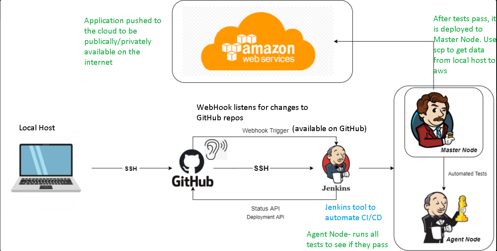

# How to set up Jenkins

-Following the diagram we will create a SSH key to connect GitHub with Jenkins so code can be read by Jenkins in a secure way. This is part of the CI process. 
-For a job created in Jenkins, it will be able to track any changes to the GitHub repo referred to in it's configuration settings.

# Create a Jenkins key
1. `cd ~/.ssh` : Go into your .ssh folder
2. `ssh-keygen -t rsa -b 4096 -C "your_github_email.com"` replace the github email with your actual email
3. `jaspreetjenkins` - file name for the ssh key
4. `passphrase` - you don't need to enter anything, hit enter x2
5. your keys should load
6. `ls` : you should see `newjaspreetjenkins.pub` = public key and `newjaspreetjenkins` = private key
- Public key ending in .pub will be used in GitHub and Private key in Jenkins to clone your repo.
- If the correct key is not passed into GitHub or Jenkins the ssh connection from GitHub to Jenkins will fail. We have ssh key to establish a connection between Jenkins and GitHub.

# Build a job in Jenkins
1. Login to Jenkins
2. Click create new jobs/ new item
3. Select `freestyle projects` and give it a name `jaspreet_testing_jenkins`, then click `OK`
4. Give it a description and select `discard old builds` in the `General section`
Max builds- select as 3.
5. `Build section`: under `Add Build step` select `Execute shell`
6. `Commands`: Input the following `date`.
7. Dashboard: Click on the job you created `jaspreet_testing_jenkins` and select `Build now` from side tab or drop down next to name.
8. Build history should display it being built under the number of the job.

# Configure the job in Jenkins
1. `Configure` : select this from the side tab.
2. `GitHub Project`: Go to GitHUB -> your repo -> under code select `HTTP` and copy your githublink `https://github.com/jaspreet/...` Paste link in Jenkins GitHub Project heading (make sure it is selected)
- Doing this we are instructing Jenkins to go and get the code from GitHub repo.
3. Go back to GitHub -> your repo -> under code select `SSH` and copy the ssh link `git@github.com:jaspreet...`
4. In Jenkins Configure -> Source Code Management -> Repository URL -> paste the SSH link. (HTTP link if it doesnt work).
5. For Credentials click `Add`-> Select `Jenkins` -> 
- Kind : select `SSH Username and private key`
- Username : `newjaspreetjenkinsprivate` give a name for your key
- Select Private key: from git bash -> in .ssh folder -> `nano newjaspreetjenkins` -> copy the private key
- Paste in the private key -> Then click `Add`
6. In GitHub -> in your repo -> go to settings -> click `Deploy keys` in side tab -> Click `Add Deploy key`
7. In GitBash -> in .ssh folder -> `cat newjaspreetjenkins.pub` -> copy it
8. Paste the public key in GitHub as a deploy key and give a title for the key -> when prompted enter GitHub password
- You should see the key in the repo now.
9. In Jenkins -> Source Code Management -> Credentials -> Select your private key from the drop down.
- For Branches to build enter `*/main`
10. Build Triggers -> Select `Github hook trigger for GitScm#`
11. Office 365 Connector -> Select `Restrict where this project can be run` -> Label Expression: Enter `sparta-ubuntu-node`
12. Build Environment -> Select Provide Node & npm bin/folder to PATH
13. Build -> Execute shell -> enter the commands
- `cd app`
- `npm install`
- `npm test`
14. Post-build Actions -> Projects to build: `jaspreet_computer_name` and another builds you want triggered if the build is stable (select this from the list)
15. Click Save -> you will be taken to the Dashboard
16. Select your job `jaspreet_testing_jenkins` -> in dropdown select `Build now`
17. In your `Build history` make sure it has turned `blue` and it has successfully been able to get your code and run the commands.

## Creating Webhook
Creating a webhook will trigger Jenkins to run the project when changes are committed and pushed to your GitHub repository.
1. In Jenkins-> your project (`jaspreet_testing_jenkins`) -> Configure (side tab) -> make sure you have your repository set in GitHub Project (steps 1-3 of Configure)
- So basically when changes are made to GitHub repo (stated in GitHub Project) you want this Jenkins project to be trigurred and run.
- step 10 from above should be followed to ensure project is triggured
2. In GitHub repo `Devops_bootcamp` -> settings -> side tab- click Webhooks -> Add webhook -> 
-`Payload_url` -> enter jenkins url (this is your id of jenkins:port which jenkins is running on/enter github-webhook after the url/)`http://some_numbers_seperated_with_dots:8080/github-webhook/` (ensure the ending /)  
- `Content-type` -> select `application/json`
- `Which events would you like to trigger` -> make sure the `Just the push event is selected` (if you want to add more triggers you can select `Let me select individual events`)
- `Active` -> should be selected
3. Click Add webhook
4. Your should see the webhook appear in your list of webhooks.
5. If you go to your GitHub repo and make changes a file (any file, iv'e choses `Jenkins.md`) -> Then commit those changes -> You should see your project in Jenkins being built.

